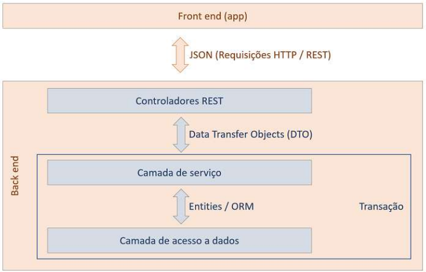

## 🏗️ Arquitetura do Projeto

O projeto segue uma arquitetura em camadas, separando responsabilidades entre
controladores, serviços e acesso a dados.

### Visão Geral

Front-end (App)
↓
Controladores REST
↓
DTOs
↓
Camada de Serviço (Regras de Negócio / Transações)
↓
Entidades (ORM / JPA)
↓
Camada de Acesso a Dados (Repositories)
-----------------------------------------------------------------
🏗️ Arquitetura da Aplicação
---
Este projeto segue uma arquitetura em camadas, separando responsabilidades entre front-end, controladores, regras de negócio e acesso a dados. Essa abordagem melhora a organização, manutenção, testabilidade e escalabilidade da aplicação.

-----------------------------------------------------------------
🌐 Front-end (App)
---
Responsável pela interface com o usuário.
Consome a API através de requisições HTTP/REST.
Envia e recebe dados no formato JSON.
Não possui lógica de negócio, apenas apresentação e interação.
-----------------------------------------------------------------
🔗 Comunicação
---
A comunicação entre o front-end e o back-end é feita via API REST.
Os dados trafegam no formato JSON.
Os endpoints seguem os padrões REST (GET, POST, PUT, DELETE).
-----------------------------------------------------------------
🧩 Back-end
---
O back-end é dividido em camadas bem definidas:

🎮 Controladores REST (Controllers)
---
Ponto de entrada das requisições HTTP.

Responsáveis por:

- Receber requisições do front-end
- Validar dados de entrada
- Mapear requisições e respostas
- Não contêm regras de negócio.
- Utilizam DTOs (Data Transfer Objects) para comunicação.
-----------------------------------------------------------------
📦 DTOs (Data Transfer Objects)
---
Objetos usados para transferir dados entre camadas.
Evitam expor diretamente as entidades do domínio.

Permitem:

- Controle do que é enviado/recebido
- Validações
- Segurança e desacoplamento
-----------------------------------------------------------------
🧠 Camada de Serviço (Service)
---
Contém as regras de negócio da aplicação.

Orquestra as operações:
- Validações de domínio
- Regras funcionais
- Fluxos de processamento

Responsável pelo controle de transações.

Faz a conversão entre DTOs e Entidades.

-----------------------------------------------------------------
🧬 Entidades / ORM
---
- Representam o modelo de domínio da aplicação.
- Mapeadas para o banco de dados via ORM (ex: JPA/Hibernate).
- Contêm atributos e relacionamentos.
- Não possuem lógica de infraestrutura ou apresentação.
-----------------------------------------------------------------
🗄️ Camada de Acesso a Dados (Repository / DAO)
---
Responsável pela comunicação com o banco de dados.
Executa operações de CRUD.

Utiliza abstrações como:

- Repositories
- JPQL / SQL

Não contém regras de negócio.

-----------------------------------------------------------------
🔁 Transações
---
Gerenciadas principalmente na camada de serviço.

Garantem:

- Consistência dos dados
- Atomicidade das operações

Exemplo: uso de @Transactional.

-----------------------------------------------------------------